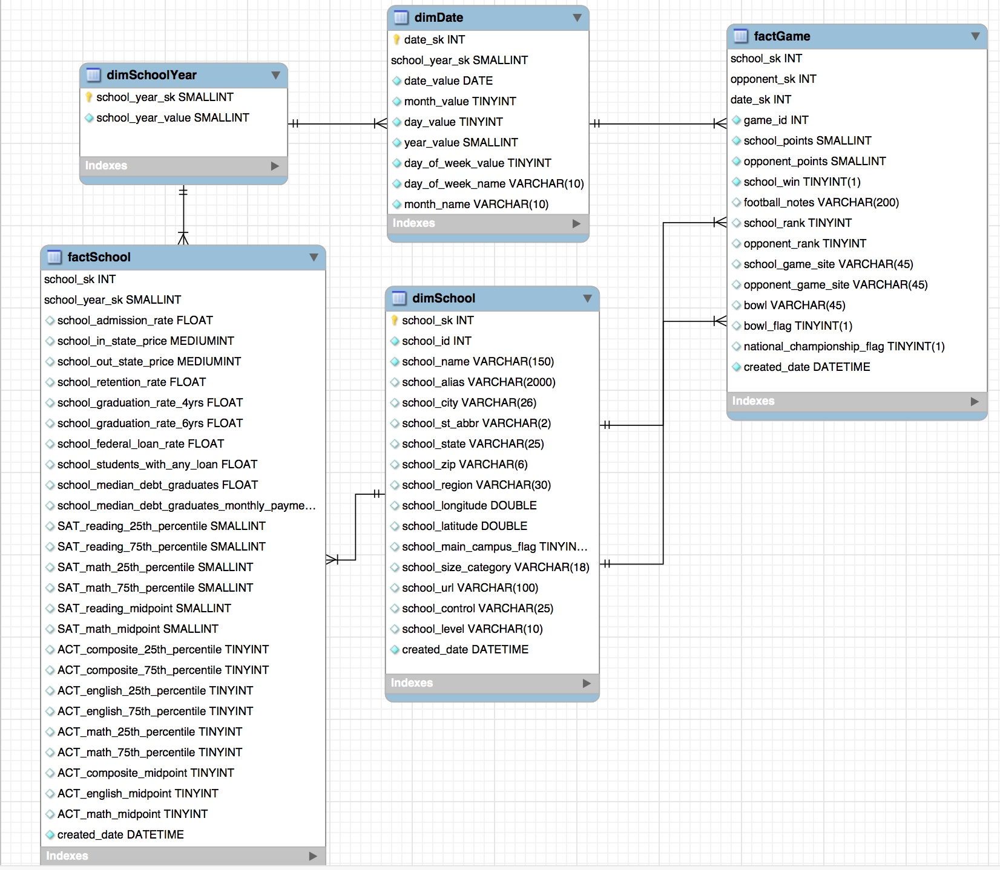

<!-- This adds horizontal scroll bars to all the code chunks --> 
```{css}
pre code, pre, code {
  white-space: pre !important;
  overflow-x: scroll !important;
  word-break: keep-all !important;
  word-wrap: initial !important;
}
```

**Abstract**

Using a dimensional model, data warehouse, and reporting I explored data from the College Scorecard and NCAA Division I FBS football games to create a data-driven approach to school selection for college football fans. 

**Overview**

**Data Warehouse Opportunity and Objectives**

For many students in the United States, NCAA Division I football is an important part of their student life and college experience. It is also my biased opinion that college football is fun to watch, especially when you have an emotional investment in one of the teams playing. Thus, I saw an opportunity to create a data-driven approach to school selection for college football fans. 

The data-driven approach included several objectives:

* Retrieve data from the College Scorecard using the available API
* Scrape NCAA Division I college football game scores from the web 
* Cleanup and transform the data
* Create a dimensional data model  
* Load the data into a MySQL data warehouse running on AWS
* Create an interactive dashboard that allows users to input certain criteria regarding school location, size, graduation rate, total cost, etc. and get back a filtered list of schools showing a map of the school location, cost per win, point differential per game, points per game, etc.

```{r}
#load libraries
library(RMySQL)
library(data.table)
library(plyr)
library(dplyr)
library(rscorecard)
library(stringr)
library(rvest)
library(stringdist)
```

**Source Data**

There are two data sources for this project. I am using the available API provided by College Scorecard (https://collegescorecard.ed.gov/data/documentation/) to extract the relevant school data. The College Scorecard combines data from the Integrated Postsecondary Education Data System (IPEDS), National Student Loan Data System (NSLDS), and various other sources into one dataset and makes it available through an API. The extraction process includs selecting the desired data fields, determining which years to pull data for, and creating the API call to return the data. The API is preferred to navigating to the IPEDS website and exporting the data via CSV, which you can do. The API allows for much easier access to the data and can be easily updated when new data becomes available. The latest full dataset available is for the 2015-2016 school year. I will be extracting the last 5 school years worth of data (2011-2012, 2012-2013, 2013-2014, 2014-2015, 2015-2016).

In R, there is an existing package called rscorecard that "provides a series of piped functions (a la dplyr) to facilitate downloading Department of Education College Scorecard data. In reality it is simply a method for converting idiomatic R code into a properly formatted URL string that is then queried." This package does require an API key which I requested at https://api.data.gov/signup/. I added the API key to the .Renviron file to maintain security best practices (http://blog.revolutionanalytics.com/2015/11/how-to-store-and-use-authentication-details-with-r.html) 

```{r}
#added rscorecare API key to .Renviron file as DATAGOV_API_KEY which is searched for when sc_get() is run
#get comma separated column names for input into sc_selct
paste(readLines('columns.csv'), collapse = ", ") 
#want data for school years starting 2011-2015
years <- seq(2011, 2015)

# get data for desired years and combine it all in one data table
school_data_staging_api <- rbindlist(lapply(years, function(x) {
  sc_init() %>%
    sc_filter(ICLEVEL == 1, CONTROL == 1:2) %>% #filter for all 4 year schools that are public or private non-profit
    sc_select(UNITID, OPEID, OPEID6, INSTNM, CITY, STABBR, ZIP, INSTURL, MAIN, CONTROL, REGION, LATITUDE, LONGITUDE, ADM_RATE, SATVR25, SATVR75, SATMT25, SATMT75, SATVRMID, SATMTMID, ACTCM25, ACTCM75, ACTEN25, ACTEN75, ACTMT25, ACTMT75, ACTCMMID, ACTENMID, ACTMTMID, UGDS, TUITIONFEE_IN, TUITIONFEE_OUT, C150_4, RET_FT4, PCTFLOAN, GRAD_DEBT_MDN, GRAD_DEBT_MDN10YR, LOAN_EVER, ALIAS, C100_4, ICLEVEL) %>%
    sc_year(x) %>%
    sc_get()
})) 
```

```{r echo=FALSE}
head(school_data_staging_api)
```

For the football data, I am going to scrape data from http://www.sports-reference.com, a sports statistics clearinghouse that allows free downloads of data. You can export this data to CSV, but I'm going to scrape it so I don't have to deal with multiple CSV files. To mirror the school data, I will be extracting the data for the same school years as mentioned above (2011-2012, 2012-2013, 2013-2014, 2014-2015, 2015-2016).
```{r}
#create urls based on the years we want data for
urls <- paste0("https://www.sports-reference.com/cfb/years/",years,"-schedule.html")

#get html from urls
urls_html <- lapply(urls, function(x) {
  read_html(x)
  })

#get the data for each url and combine it into one data table
football_data_staging <- rbindlist(lapply(urls_html, function(x) {
  x %>%
    html_nodes("table") %>%
    .[[1]] %>%
    html_table()
  }), fill = TRUE) #fill has to equal true here because different years have different columns included in the data
```

```{r echo=FALSE}
head(football_data_staging)
```

**Data Cleanup**

We now have all of the school and football data! But, we've got to clean it up! I'm going to do these clean up procedures in R, but you could at this point load the staging data into MySQL and use SQL to clean up the data.

**School Data**

I'll start with the school data. Overall, it's in pretty good shape. The main things we have to do are rename the columns so they are a little more user friendly and decode columns like "CONTROL", "ICLEVEL", "REGION", etc. so that instead of containing numbers they contain what those numbers mean (e.g. a "CONTROL" value of 1 means it is a public school).

First, I'll get out my decoder ring! We'll need to decode region, control, iclevel, and we'll include the full state name based on the state abbreviation. The decoder file can be obtained from IPEDS (all of these columns come from that data source) or can be found in the College Scorecard data dictionary (https://collegescorecard.ed.gov/assets/CollegeScorecardDataDictionary.xlsx). I have a CSV file containing relevant info and will use that to replace the numbers in the staging data with the more easily understood meanings.

```{r}
#decode region, control, level, and state abbreviations
#get lookup table
lookups <- read.csv("lookups.csv", stringsAsFactors = FALSE)
#remove parentheses after field name using regex
lookups$VariableName <- gsub("\\s\\([^)]*\\)","",lookups$VariableName,perl = TRUE)

#subset lookup values for region, control, level, and state abbr
control <- lookups[lookups$VariableName =="Control of institution",]
level <- lookups[lookups$VariableName =="Level of institution",]
regions <- lookups[lookups$VariableName =="Bureau of Economic Analysis regions",]
states <- lookups[lookups$VariableName =="State abbreviation",]

#perform lookups
school_data_transform <- school_data_staging_api #make a copy of the original data 
school_data_transform$region <- plyr::mapvalues(school_data_transform$region, from = regions$Value, to = regions$ValueLabel)
school_data_transform$control <- plyr::mapvalues(school_data_transform$control, from = control$Value, to = control$ValueLabel)
school_data_transform$iclevel <- plyr::mapvalues(school_data_transform$iclevel, from = level$Value, to = level$ValueLabel)
school_data_transform <- left_join(school_data_transform, states[,2:3], by = c("stabbr" = "Value"))

#clean up region value using regex
school_data_transform$region_clean <- str_trim(gsub("((?!US))(\\b[[:alpha:]]{2}\\b)", " ", school_data_transform$region, perl = TRUE), side = "right")

#keep only the first 5 numbers for zip code; some values are missing dash between zip and zip +4 code
school_data_transform$zip <- str_sub(school_data_transform$zip, 1, 5)

#create field for size category
school_data_transform$school_size_category <- ifelse(school_data_transform$ugds < 1000,"Under 1,000",
                                                     ifelse(between(school_data_transform$ugds, 1000, 4999),"1,000 - 4,999",
                                                            ifelse(between(school_data_transform$ugds, 5000, 9999), "5,000 - 9,999",
                                                                   ifelse(between(school_data_transform$ugds, 10000, 19999),"10,000 - 19,999",
                                                                          ifelse(school_data_transform$ugds > 20000, "20,000 and above", NA)))))
  
#rename columns to give more readable names
old_school_names <- names(school_data_transform)
new_school_names <- c("school_region_all",
                      "school_longitude", 
                      "school_main_campus_flag", 
                      "school_name", 
                      "school_city", 
                      "school_control", 
                      "school_level", 
                      "school_zip", 
                      "school_latitude", 
                      "school_opeid6", 
                      "school_url", 
                      "school_opeid8", 
                      "school_st_abbr", 
                      "school_id", 
                      "school_addmission_rate", 
                      "SAT_reading_25th_percentile", 
                      "SAT_reading_75th_percentile", 
                      "SAT_math_25th_percentile", 
                      "SAT_math_75th_percentile", 
                      "SAT_reading_midpoint", 
                      "SAT_math_midpoint", 
                      "ACT_composite_25th_percentile", 
                      "ACT_composite_75th_percentile", 
                      "ACT_english_25th_percentile",
                      "ACT_english_75th_percentile",
                      "ACT_math_25th_percentile",
                      "ACT_math_75th_percentile",
                      "ACT_composite_midpoint",
                      "ACT_english_midpoint",
                      "ACT_math_midpoint",
                      "school_size",
                      "school_in_state_price",
                      "school_out_state_price",
                      "school_graduation_rate_6yrs",
                      "school_retention_rate",
                      "school_federal_loan_rate",
                      "school_median_debt_graduates",
                      "school_median_debt_graduates_monthly_payments",
                      "school_students_with_any_loan",
                      "school_alias",
                      "school_graduation_rate_4yrs",
                      "school_year_start",
                      "school_state",
                      "school_region",
                      "school_size_category")
setnames(school_data_transform, old = old_school_names, new = new_school_names)
```
Instead of using the mapvalues function, you could left join the readable values into the data table, but I figured I didn't need the 1's and 2's so I just replaced them. I did want to keep the state abbreviation, so I left joined in the full state name so I could have both columns. 

**Football Data**

The football data is a bit more messy than the school data. For example, the row headers are sometimes repeated in the middle of the dataset. Also, for some schools the ranking precedes the school name (i.e. “(2) Alabama”).

```{r}
#create a copy of the staging data for transformations
football_data_transform <- football_data_staging 

#dataframe has two columns with same name which causes problems down the road
names(football_data_transform)[6] <- "school_points" 
#remove rows where the headers are repeated and games were cancelled
football_data_transform <- football_data_transform[football_data_transform$Rk != "Rk" & football_data_transform$Notes != "Game Cancelled",] 
#put winner rank in separate column
football_data_transform$school_rk <- str_trim(gsub("[^0-9]", "", football_data_transform$Winner), "right")
#remove winner rank from school name
football_data_transform$Winner <- str_trim(gsub("\\(\\d{1,2}\\)", "", football_data_transform$Winner, "left"))
#put loser rank in separate column
football_data_transform$opponent_rk <- str_trim(gsub("[^0-9]", "", football_data_transform$Loser), "right") 
#remove loser rank from school name
football_data_transform$Loser <- str_trim(gsub("\\(\\d{1,2}\\)", "", football_data_transform$Loser, "left"))
#create field for if the winner was at home, away, or at a neutral site
football_data_transform$school_home <- ifelse(football_data_transform$V1 == "@", "away", 
                                              ifelse(football_data_transform$Notes == "", "home", "neutral"))
#create field for if the loser was at home, away, or at a neutral site
football_data_transform$opponent_home <- ifelse(football_data_transform$school_home == "away", "home", 
                                                ifelse(football_data_transform$school_home == "home", "away", "neutral"))

old_football_names <- names(football_data_transform)
new_football_names <- c("game_id",
                        "football_week",
                        "game_date", 
                        "game_day", 
                        "school",
                        "school_points",
                        "home_away",
                        "opponent",
                        "opponent_points",
                        "football_notes",
                        "game_time",
                        "game_tv",
                        "school_rank",
                        "opponent_rank",
                        "school_game_site",
                        "opponent_game_site")
setnames(football_data_transform, old = old_football_names, new = new_football_names)
```

Ok, we have all the school and football data we want and it is cleaned up. Now, we're ready to create our data model!

**Dimensional Model**

For this project, I'm going to create a star schema. The first step in creating the dimensional data model is profiling the data in order to better understand how the data from the two different sources fits together. During this profiling step, I determined what data types best fit each attribute in both data sets and what sizes to make each data type.

```{r}
school_data_character_lengths <- lapply(school_data_transform, function(x) max(nchar(x), na.rm = TRUE))
football_data_character_lengths <- lapply(football_data_transform, function(x) max(nchar(x), na.rm = TRUE))
```

I also created the business rules that govern the data:

* Each school is defined as a four year university or college located within the United States of America
* Each football game is played by two and only two universities
* Each football game is played by at least one university that is designated by the NCAA as a Division I football program
* The following attributes in the factGame table are Boolean fields, with 0 representing a value of “No” and 1 representing a value of “Yes”: school_win, school_main_campus_flag
* School year is defined as the twelve months starting in August of a given year and ending in July of the following calendar year
* A school can have many school facts
* A school fact is associated to only one school
* A school can have many game facts
* A game fact is associated to only one school
* A school year can have many school facts
* A school fact is associated to only one school year
* A school year is associated with many dates
* A date can have only one school year
* A date is associated with many games
* A game can have only one date

One tricky aspect of this data set is the conformed dimension. The conformed dimension in the data warehouse between the two data sources is the school name. However, the syntax for school name is different between the two data sources (i.e. Ohio State vs. Ohio State University). Thus, to be able to join the school and football data sets together, we needed to perform fuzzy text matching.

Other challenging aspects of modeling this data are how best to handle the dynamic of dimSchool being a role playing dimension, as well as schools sometimes being winners and sometimes losers, and some games played at home and others away. I eventually settled on the solution of loading each game into the factGame table twice, with each role through the perspective of each school playing in that game. I also decided to add in a dimDate attribute of school_year, and then snowflake it.I did this in order to better handle the grain discrepancy between the football game data (played on a specific date) and the school data (tied to a school year) when trying to report on the two sets of data at once. Having only the school year in the school data created a many to many relationship and snowflaking this dimension solved that issue.


**Fact Tables:**

* factSchool – This table contains all facts related to a given school, uses school_year_sk and school_sk as surrogate keys
* factGame – This table contains all facts related to a game; date_sk, school_sk, and opponent_sk are the surrogate keys.

**Dimension Tables:**

* dimSchool – This table contains dimensions for a given school; school_sk is the surrogate key. school_sk is a role playing dimension for the factGame table
* dimSchoolYear – This table contains the school year that relates to school facts; school_year_sk is the surrogate key.
* dimDate – This table contains specific dates for when a game was played and the school year in which the game was played

Here is the final data model created in MySQL Workbench.

#

**Fuzzy Text Matching**

As mentioned previously, the only attribute that ties the school data and the football data together is the school name. Thus, in order to be able to join the two data sets together, we need to create a lookup table that contains the school name from the football data and the corresponding school name from the school data. We'll use fuzzy text matching in R to create this table. 

We'll start by getting the unique school names from the school data set and the unique school names from the football data set. 

```{r}
#get unique school names
#there are some colleges that have the same name but are in different locations, but for matching school name we only need one instance of the name
unique_school_names <- data.table(schools = unique(school_data_transform[school_data_transform$school_year_start == 2015 & school_data_transform$school_main_campus_flag == 1, "school_name"]))

#get unique football school names by combining values in the school and opponent columns into one column
unique_football_names <- data.table(football_schools = c(as.matrix(football_data_transform[, c("school", "opponent")])))
unique_football_names <- unique(unique_football_names)
```

Now, can perform the actual fuzzy text matching:

```{r}
#use stringdist for fuzzy text matching; run through all possible methods used for distance calculation
#cross join football names with all school names (227 football names * 2187 school names = 496449 possible combinations)
fuzzy_text_results_all <- CJ(football_schools = tolower(unique_football_names$football_schools), schools = tolower(unique_school_names$schools))
method_list <- c("osa", "lv", "dl", "hamming", "lcs", "qgram", "cosine", "jaccard", "jw", "soundex")
for( i in method_list){
  fuzzy_text_results_all[,i] <- stringdist(fuzzy_text_results_all$football_schools,fuzzy_text_results_all$schools, method = i)
}
```

A cross join is used to match up all the football names with all of the school names so each combination can be assessed for string distance. I'm using all available string distance methods so I can filter the data based on the method(s) that provide the best results. The definitions of the different string distance methods can be found here https://www.rdocumentation.org/packages/stringdist/versions/0.9.4.6/topics/stringdist-metrics 

```{r echo = FALSE}
head(fuzzy_text_results_all)
```

Now we can filter the data based on the best matches. This is still somewhat of a manual process but the fuzzy text matching is inifinitely better than manually matching the strings.

```{r}
#filter data based on exact matches
exact_text_matches <- fuzzy_text_results_all[fuzzy_text_results_all$cosine == 0, ]
#filter data based on matches that are close and need manual review
close_text_matches <- fuzzy_text_results_all[fuzzy_text_results_all$jw < 0.20 & !(fuzzy_text_results_all$football_schools %in% exact_text_matches$football_schools), ]
#add column for user to update with 0 if the match is no good
close_text_matches$correct_match <- 1
#requires manual editing to determine good matches
close_text_matches <- edit(close_text_matches)

#this is an iterative process where you can add the correct matches to a final match data table until all schools are matched
fuzzy_text_match_final <- exact_text_matches[ , c("football_schools", "schools")]
fuzzy_text_match_final <- rbindlist(list(fuzzy_text_match_final, close_text_matches[close_text_matches$correct_match == 1, c("football_schools", "schools")]))
```

I also concantenated "university of" to the football school names and reran the fuzzy text matching

```{r}
#concantenate university on all remaining unmatched schools and run text matching again
unmatched_text <- fuzzy_text_results_all[!(fuzzy_text_results_all$football_schools %in% fuzzy_text_match_final$football_schools), ]
unmatched_schools <- unmatched_text[, c("football_schools", "schools")]
unmatched_schools$football_schools <- paste("university of", unmatched_schools$football_schools)

method_list <- c("osa", "lv", "dl", "hamming", "lcs", "qgram", "cosine", "jaccard", "jw", "soundex")
for( i in method_list){
  
  unmatched_schools[,i] <- stringdist(unmatched_schools$football_schools, unmatched_schools$schools, method = i)
  
}

unmatched_schools_close <- unmatched_schools[unmatched_schools$jw < 0.1, ]
unmatched_schools_close$correct_match <- 1
unmatched_schools_close <- edit(unmatched_schools_close)

unmatched_schools_close$football_schools <- gsub("university of ", "", unmatched_schools_close$football_schools)
fuzzy_text_match_final <- rbindlist(list(fuzzy_text_match_final, unmatched_schools_close[unmatched_schools_close$correct_match == 1, c("football_schools", "schools")]))
```

All in all, this is a messy process with lots of iteration, filtering, and manual review. In the end, I was able to match 84% of the school names using the output from the fuzzy text matching. The school names that were difficult to match were ones like penn state = pennsylvania state university-main campus or ucla = university of california-los angeles.

**Creating tables in data warehouse**

From the data model, I want to create the tables in my data warehouse on AWS. To do this I first connect to my database in MySQL Workbench. Then select Database>Forward Engineer. The wizard guides you through the process and generates the necessary SQL to create the database and tables. You could also do this in R, but since I did the modeling in MySQL Workbench it is easy to hit a few buttons to create the tables using the GUI.

Now that my tables are created, I want to load the clean data into my data warehouse. First step is to connect to my database in R. I put my username, password, and host information into the .Renviron file so I could access it without putting it my code.

```{r}
con <- dbConnect(MySQL(),
                 user = Sys.getenv("RDSuser"),
                 password = Sys.getenv("RDSpw"),
                 host = Sys.getenv("RDShost"),
                 dbname='FootballSchoolDW') #open connection to RDS
```

Now that I have a connection to the database. I can write the data to it. I could setup the dimSchool table as a type 2 slowly changing dimension, but I decided that I did not need a history of the changes from 2011 to 2015. I found that several changes from one year to the next were minor. Thus, I setup the dimSchool dimension as a type I slowly changing dimension. As a result, you'll notice that I'm only including the school information from the latest school year that I have, which is 2015. 

```{r}
dbWriteTable(con, name = "dimSchool", 
             value = school_data_transform[school_data_transform$school_year_start == 
                                             max(school_data_transform$school_year_start), 
                                                        c("school_id",
                                                          "school_name",
                                                          "school_alias",
                                                          "school_city",
                                                          "school_st_abbr",
                                                          "school_state",
                                                          "school_zip",
                                                          "school_region",
                                                          "school_longitude",
                                                          "school_latitude",
                                                          "school_main_campus_flag",
                                                          "school_size_category",
                                                          "school_url",
                                                          "school_control",
                                                          "school_level")], append = TRUE, row.names = FALSE)
```

